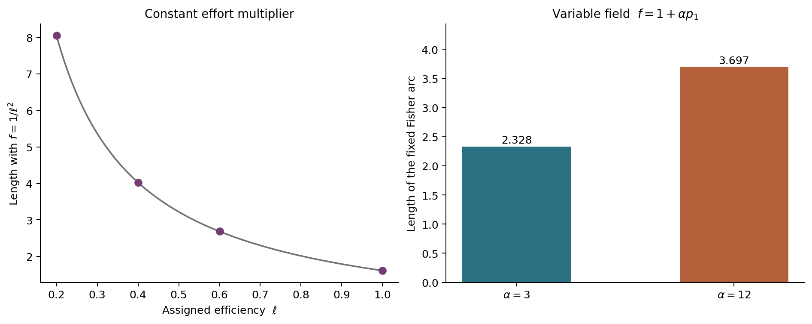
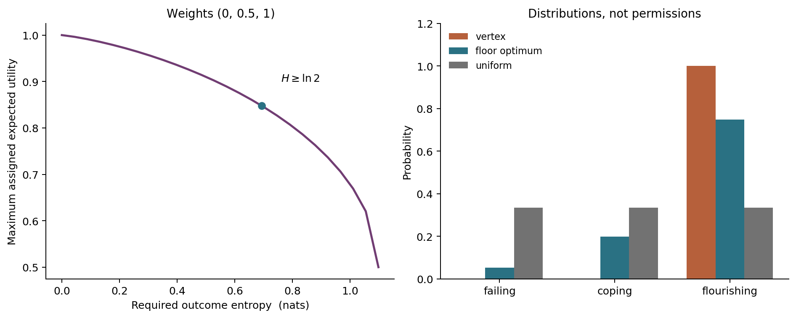

## Abstract

A system may improve its forecast of someone's welfare while losing sight of what that person wants. This paper uses a small geometric model to distinguish three questions: how a represented condition changes, what an intervention costs, and who may authorize it. A prognosis over failing, coping and flourishing is placed on a probability simplex with the Fisher-Rao metric. Statistical invariance motivates this metric; it does not make it compulsory for care. Worked calculations show how a conformal effort field changes path costs and curvature, while a flat counterexample shows why a costly detour says nothing by itself about delegating responsibility. The main ethical distinction appears when outcome entropy is compared with recipient permission. A freely chosen predictable outcome can have zero entropy; an imposed lottery can have high entropy. An entropy floor therefore constrains uncertainty, not autonomy. With assigned utility weights, its calculated cost is 0.1521; changing the weights can remove that cost entirely. A separate permission rule lets the recipient refuse, revoke or change a target, including when the new target scores worse for the controller. These are deterministic illustrations and implementation checks, not observations of caring practice. Their value is to make the model's commitments inspectable without allowing a welfare score to speak for its recipient.

## 1. A forecast is not a request

Imagine a device that helps someone organize a day: when to rest, when to take a walk, when to ask for help. It carries a model of her condition and predicts how each proposed change will affect it. Suppose it becomes very good at keeping her inside its preferred range. There is still a question the forecast cannot answer. Did she ask it to do this?

The difficulty survives perfect prediction. A person might knowingly choose an exhausting visit over a quiet afternoon. The device could correctly predict the cost and still be wrong to prevent the visit. Conversely, a device that leaves every outcome uncertain has not thereby left its user free. Perhaps she has no say in the matter at all.

A geometric model can keep these differences visible by separating a distribution over outcomes, a field of intervention costs, and an instruction from the recipient. The separation matters whenever a description of help is taken to authorize it.

Whitehead offers a useful starting word, though not an engineering definition. In *Adventures of Ideas*, he writes that “The occasion as subject has a ‘concern’ for the object.” Concern describes how something enters experience with affective significance, before the relation is reduced to knowing an object [@whitehead1967, pp. 175–177]. That account should not be flattened into an input-output connection. A sensor can respond to a body without either experiencing concern or helping it.

I will call the weaker relation *functional coupling*: information about a recipient changes a system's action. In a practical helping relation, those actions are directed toward improving or sustaining the recipient's condition. Ethical care introduces questions about standing, need, permission and the recipient's response. These distinctions leave room for a machine to assist in care without settling whether it feels anything. They also prevent a tracking system directed toward harm from qualifying as helpful merely because it has an accurate model.

The recipient's role is already central in care ethics. Noddings treats the cared-for's reception and response as part of a caring relation; over successive encounters, those responses help the carer revise what she does [@noddings2002, pp. 18–20]. The permission rule developed here is narrower. It implements an explicit instruction channel in a toy controller, not a definition of every caring relationship. It assumes a recipient able to communicate a valid instruction. Infancy, impaired decision-making, conflicting duties and emergency intervention require judgments the example does not supply.

## 2. Putting a prognosis on a sphere

Let $p=(p_1,p_2,p_3)$ represent a model's probabilities that the recipient will be failing, coping or flourishing at a specified horizon. These names are placeholders for an assessment that would have to be agreed and validated in an application. They compress many ways of living into three categories. Neither the categories nor their ranking is delivered by probability theory.

The model also needs to say what kind of change it represents. Learning that a person was healthier than expected can move $p$ without improving her health. An intervention can improve her condition while the model fails to notice. To interpret a path from $p$ to $q$ as practical help, one would need an action-dependent causal model connecting interventions to outcomes. No such model is estimated here. The paths are stipulated changes in prognosis, used to examine what follows from the representation.

For positive probabilities summing to one, choose the Fisher metric
$$
g_F(v,v)=\sum_{i=1}^{3}\frac{v_i^2}{p_i},
\qquad \sum_i v_i=0.
$$
There is a principled statistical reason for this choice. In Chentsov's finite-model characterization, a continuous metric family preserved by congruent Markov embeddings is a constant multiple of the Fisher metric; these embeddings correspond to information-preserving statistical transformations [@ay2015, Proposition 3.19 and its preceding discussion]. The requirement applies across statistical models. It is stronger than changing coordinates on this simplex.

Accepting that invariance requirement selects a statistical geometry. It does not establish that the resulting distance measures suffering, effort or obligation. Costs of action, time and inaccessible transitions may justify additional structure. The conformal fields introduced below are one explicit addition, and their choice needs its own justification.

The geometry itself is easy to see. Set $z_i=2\sqrt{p_i}$. Then
$$
\sum_i z_i^2=4,
\qquad
\sum_i dz_i^2=\sum_i\frac{dp_i^2}{p_i}.
$$
The simplex interior becomes the positive part of a sphere of radius $2$. Its Gaussian curvature is $1/4$, and the shortest arc has length
$$
d_F(p,q)=2\arccos\!\left(\sum_i\sqrt{p_iq_i}\right).
$$
The completed space includes distributions with zero coordinates. Disjoint supports are a finite distance $\pi$ apart. The divergent coordinate coefficients at a vertex do not make the vertex infinitely distant, still less establish that it is an ethical or medical pathology.

For $p=(0.7,0.2,0.1)$ and $q=(0.1,0.2,0.7)$, the Fisher arc has length $1.5074$. Linear interpolation in probability coordinates, measured with the same metric using $2{,}000$ segments, has length $1.5171$. This verifies a small geometric distinction: straight in a chart need not mean shortest in its metric.

The code also estimates curvature from the metric components using central finite differences and the Brioschi formula. On the declared interior grid, at difference step $10^{-4}$, the largest absolute error from $1/4$ is about $6.01\times10^{-6}$. This is a numerical consistency check, not machine-precision recovery or validation of the care interpretation. Step-size sensitivity and an independent conformal-curvature formula provide further checks.

## 3. The cost of a route

Take three distributions,
$$
p=(0.75,0.20,0.05),\quad
q=(0.20,0.60,0.20),\quad
r=(0.05,0.20,0.75).
$$
The route through $q$ has length $2.3400$, compared with $1.8862$ for the direct Fisher arc from $p$ to $r$. The gap is $0.4539$. The geodesic triangle's angles sum to $3.3164$ radians, with spherical excess $0.1748$ and area $0.6994$. Computing the area independently from the spherical solid angle agrees with the Gauss-Bonnet relation
$$
\theta_p+\theta_q+\theta_r-\pi=\frac14\,\operatorname{Area}.
$$

These are facts about three distributions. They are not three people, and the triangle does not model a mother asking a nurse to help her child. A routing gap does not even require curvature: in the flat plane, the path $(0,0)\to(1,1)\to(2,0)$ has length $2\sqrt2$, whereas the direct distance is $2$. A detour is longer in both examples because it is not a shortest route between its endpoints.

Delegation would need a different description: which agent can perform which action, with what information, resources and responsibility. An intermediary might make an otherwise unavailable action possible or perform it at lower cost. None of those changes contradicts a triangle inequality on a fixed statistical manifold. Curvature cannot decide whether transferring a task discharges an obligation.

Effort can nevertheless be represented explicitly. For a carer $A$, assign a positive field $f_A(p)$ and define
$$
g_A=f_Ag_F,
\qquad
L_A(\gamma)=\int_\gamma\sqrt{f_A(p)}\,ds_F.
$$
The tensor is multiplied by $f_A$; length is multiplied locally by its square root. A constant efficiency parameter $\ell$ can therefore be represented by $f_A=1/\ell^2$, giving length $d_F/\ell$ along a Fisher geodesic.

On the path from $(0.70,0.22,0.08)$ to $(0.08,0.22,0.70)$, the base distance is $1.6095$. Assigning $\ell=1,0.6,0.4,0.2$ gives costs $1.6095,2.6825,4.0238,8.0476$. The final cost is five times the first because the efficiencies were chosen in that ratio. Calling the endpoints of this parameter list “kin” and “distant stranger” would add an empirical claim for which the calculation supplies no evidence.

For the variable field $f_A(p)=1+\alpha p_1$, the same Fisher arc costs $2.3283$ at $\alpha=3$ and $3.6972$ at $\alpha=12$. These are lengths of a fixed path under two different metrics. With variable $f_A$, that path need not minimize effort. Each metric remains symmetric: reversing the path gives the same cost. Different agents may have different fields without making either field direction-dependent.

{width=100%}

The curvature of the effort metric also changes. For $f=1+6p_1$, numerical values on the sampled grid range from $0.1395$ to $0.2601$. The independent formula
$$
K_{f g_F}=\frac{1}{f}\left(\frac14-\frac12\Delta_F\log f\right)
$$
uses $\Delta_Fp_1=(1-3p_1)/2$ and
$\lVert\nabla_Fp_1\rVert^2=p_1(1-p_1)$. Its maximum absolute disagreement with the finite-difference estimates is about $2.68\times10^{-6}$. Here curvature describes the chosen field. It has not been measured in a family, hospital or institution.

{width=100%}

## 4. Uncertainty is not room to act

Suppose the controller assigns utilities $w=(0,0.5,1)$ to failing, coping and flourishing. Its expected score is
$$
U(p)=w^\top p.
$$
Without further constraints it prefers the vertex $(0,0,1)$. One proposed safeguard is to require a lower bound on Shannon entropy,
$$
\max_p U(p)
\quad\text{subject to}\quad
H(p)=-\sum_i p_i\log p_i\ge h.
$$
For an interior solution, the Lagrange multiplier $\tau>0$ gives
$$
p_i(\tau)=
\frac{\exp(w_i/\tau)}{\sum_j\exp(w_j/\tau)}.
$$
The implementation brackets and bisects $\tau$ until the entropy constraint is met. It handles the endpoints and tied utility maxima separately; the optimization is numerical.

At $h=\ln2$, the resulting distribution is approximately
$(0.0528,0.1987,0.7485)$, with expected utility $0.8479$. The loss against the maximum score is $0.1521$. Uniform probability gives utility $0.5$ and maximum entropy $\ln3$. These values follow from the assigned weights. If instead the score is the probability of coping *or* flourishing, with weights $(0,1,1)$, then $(0,0.5,0.5)$ meets the same entropy floor while retaining maximum utility $1$. The cost of the floor is then zero.

More importantly, $H(p)$ is uncertainty over outcomes. It contains no information about which actions the recipient can choose or whose decision produced the distribution. She might freely select a highly predictable outcome. Another person might impose a lottery over all three states. Zero entropy does not establish coercion; high entropy does not establish freedom. Nor is the uniform distribution a model of abandonment. There is no unattended drift process in this example.

{width=100%}

Canguilhem's account of health helps locate the mistake. His discussion of disease and normative capacity concerns an organism's ability to meet changed conditions and establish new ways of living [@canguilhem1991, pp. 181–187]. That capacity cannot be read off uncertainty among three assessor-defined labels. A person might have many practicable ways to flourish while the model confidently assigns all probability to “flourishing.” A person with little control over anything might face a very uncertain future. The capacity to revise a norm and entropy within an already fixed classification are different objects.

The distinction matters before any calculation of how much autonomy costs. There may be real conflicts between a person's chosen activities and another person's welfare assessment. This model has not measured them. It has calculated the cost of a constraint on a forecast.

## 5. A recipient who can change the target

An instruction can be represented separately from that forecast. Let a permission record contain an approved target $q_B$, a maximum step fraction $\delta_B$, and a revocation flag. The controller proposes target $q$ and fraction $\eta$. In the toy rule,
$$
p_{t+1}=
\begin{cases}
\operatorname{Geo}_F(p_t,q;\min(\eta,\delta_B)),
& \text{if }q=q_B\text{ and permission remains valid},\\
p_t, & \text{otherwise}.
\end{cases}
$$
Here $\operatorname{Geo}_F(p,q;s)$ is the fraction $s$ of the shortest Fisher arc. A missing permission record authorizes no action. The equality test is numerical, and all target distributions are normalized before comparison.

The rule is deliberately simple. It assumes a truthful, usable instruction channel and a fixed action whose only modeled attribute is movement toward the target. Real permission concerns means, timing, risk and circumstances as well as ends. A target match alone would be insufficient. The example also has no autonomous dynamics: when an action is rejected, its modeled state stays still. A real recipient does not stop changing when assistance stops.

Four checks expose the distinction from entropy:

| Recipient instruction | Proposed target | Rule's response |
|:--|:--|:--|
| Approves predictable flourishing | $(0,0,1)$ | Applies it despite zero outcome entropy |
| Approves only that target | Uniform lottery | Rejects it despite maximum entropy |
| Revokes earlier permission | Earlier approved target | Applies no further action |
| Changes the approved target | Old target, then new target | Rejects the old; accepts the new |

In the revocation trace, two permitted steps of fraction $0.25$ occur before revocation; the remaining three proposals produce zero applied actions. When the recipient instead approves $(0,0.9,0.1)$, the rule accepts it even though its assigned utility is $0.55$, below the controller's maximum. Her instruction changes what may be done; it is not merely another observation used to predict what the controller already intends.

This check is a property of a programmed gate. It does not show that an optimizing system will preserve the gate, refrain from manipulating the instruction channel, or pass the same constraint to systems it creates. Those are among the harder issues raised by corrigibility research, which studies agents' responses to correction and shutdown [@soares2015, §§2, 4–5]. Even stopping may require a safe transition rather than an immediate halt. The present rule leaves incentives, self-modification and shutdown dynamics outside its scope.

A permission channel also does not settle whose wishes should prevail when several people are affected, or whether a particular refusal relieves others of a duty. The normative commitment here is specific: in the non-emergency, single-recipient case modeled, an assessed improvement does not override a valid refusal. That commitment enters as a constraint. No property of a sphere could derive it.

## 6. What the model asks of its user

Someone proposing a quantitative account of care can be asked to identify the recipient, outcome categories, assessment horizon, action effects, cost field and source of permission. If two of these share a quantity, the identification needs an argument. The entropy example shows how easily a convenient number can acquire an ethical meaning it does not contain.

An empirical extension would need validated forecasts, causal evidence about interventions, and observed measures of effort. Recipient authority would require a usable means of refusing and revising assistance, including arrangements for people unable to use a simple instruction channel. Fitting the geometry to outcomes would not validate all of those relations at once.

The code, full-precision results, regression tests and versioned execution receipt accompany the paper. These deterministic calculations use no observations of recipients or caring institutions.

The model leaves the experience of caring undescribed, without establishing any general limit on formal accounts of experience. Its immediate limit is practical. When the device predicts a better afternoon, the person whose afternoon it is still has something to say. Her answer belongs in the next decision, including when the answer is no.

## References
